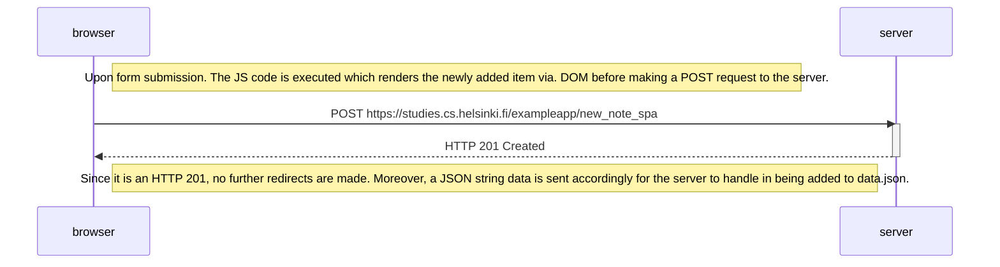

```mermaid
sequenceDiagram
    participant browser
    participant server

    Note right of browser: Upon form submission. The JS code is executed which renders the newly added item via. DOM before making a POST request to the server.

    browser->>server: POST https://studies.cs.helsinki.fi/exampleapp/new_note_spa
    activate server
    server-->>browser: HTTP 201 Created
    deactivate server

    Note right of browser: Since it is an HTTP 201, no further redirects are made. Moreover, a JSON string data is sent accordingly for the server to handle in being added to data.json.
```
